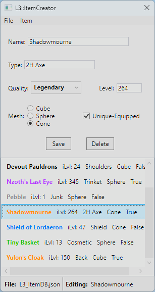

# L3_ItemCreator

This is a WPF desktop tool that helps edit the JSON file that serves as the item database for my other project [L3_UE_Tutorial](https://github.com/Raynesz/L3_UE5_Tutorial). The app can run alongside the game and update the JSON file during runtime. Just hit the [R] button in-game to see changes.

